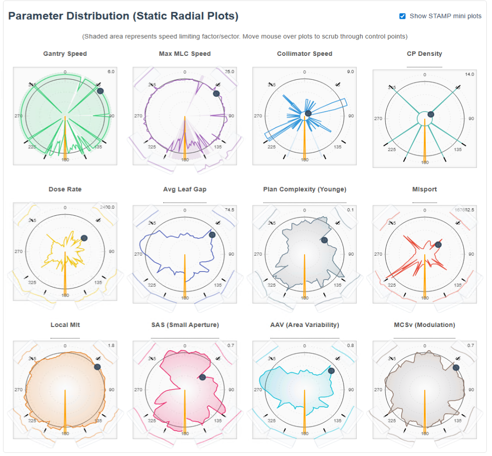
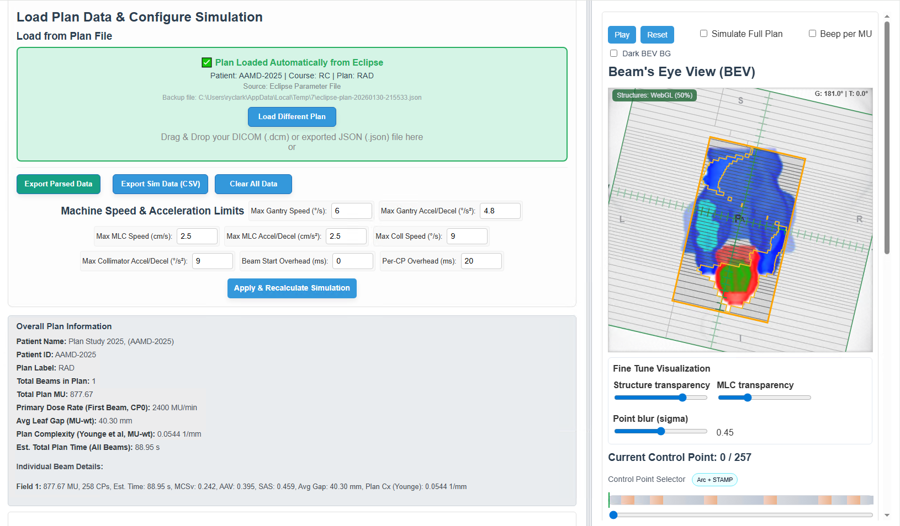

# DICOM RT Plan Delivery Simulator - README

<p align="center">
  
</p>

**Version:** 1.1.1  
**Author:** Taoran Li, PhD  
**Date:** Jan 29, 2026  
**Changelog:** `CHANGELOG.md`  
**Third-Party Notices:** `THIRD_PARTY_NOTICES.md`  
**License:** `License`

---

> © 2025–2026 Taoran Li. All rights reserved. This software is provided "as is" for educational and research purposes only. It is not intended for clinical use, patient diagnosis, or treatment planning. The accuracy of simulations and any derived data is not guaranteed. The user assumes all responsibility for the use of this software.

> This project is licensed under the Varian Limited Use Software License Agreement (`License`). It is **not** an open-source project. Third-party open-source components (if any) retain their original licenses; see `THIRD_PARTY_NOTICES.md`.

---

## 0. Versioning & Release Notes
* Update release notes in `CHANGELOG.md`.
* Keep displayed version strings in sync across:
  * `README.md`
  * `RP_Delivery_Simulator.html`
  * `RP_MultiPlan_Comparator.html`
  * `gate/index.html`
* If bundled libraries or remote resources change, update `THIRD_PARTY_NOTICES.md`.

## 1. Overview
The DICOM RT Plan Delivery Simulator is a web-based tool designed to visualize and analyze the delivery sequence of DICOM RT Plan files. It allows users to:

### Additional Screenshot
<p>
  
</p>

* Load DICOM RT Plan files (`.dcm`).
* Load and overlay RT Structure Sets (RTSTRUCT) in the BEV as an anisotropic Gaussian point cloud.
* Visualize the Beam's Eye View (BEV) including MLC and jaw positions.
* Animate the plan delivery either at a fixed speed or by simulating delivery based on configurable machine speed and acceleration limits.
* View dynamic parameters such as gantry angle, collimator angle, and simulated time.
* Inspect various calculated metrics related to plan complexity and deliverability, including:
    * Device speeds (gantry, MLC, collimator, jaws) and accelerations.
    * Dose rate.
    * MIsport (Modulation Index for SPORT, adapted from Li & Xing, 2013).
    * Local MIt (Local Modulation Index total, adapted from Park et al., 2014).
    * Overall MCSv (Modulation Complexity Score for VMAT, adapted from Masi et al., 2013).
    * Avg Leaf Gap (average leaf opening, mm).
    * Plan Complexity (Younge et al. aperture complexity metric, mm⁻¹).
* Examine these metrics through static radial plots and dynamic XY-time plots (in simulation mode).

The tool aims to provide insights into the mechanical aspects of VMAT plan delivery for educational and research applications.

---

## 2. How to Use

### Load DICOM RT Plan File:
1. Drag and drop your DICOM RT Plan (`.dcm`) file onto the designated "Drag & Drop" area.
2. Alternatively, click the "Choose File" button and select your `.dcm` file.

Upon successful loading, overall plan information (patient name, ID, plan label, total beams, total MU, primary dose rate) will be displayed. Individual beam details, including an overall MCSv (Modulation Complexity Score for VMAT, adjusted for collimator rotation), will also be shown.

### Load RT Structure Set (optional):
1. Drag and drop an RTSTRUCT (`.dcm`) file onto the same drop zone or use the file chooser.
2. Structures render in the BEV as an anisotropic Gaussian point cloud: X/Y sized by in-plane spacing, Z elongated by slice thickness. X is mirrored on parse (LPS +X → RAS –X) so left/right align with BEV.
3. Use the structure list to show/hide items; targets (PTV/CTV/GTV/ITV/TARGET) are surfaced at the top of the list. The list now shows up to 200 entries.
4. Fine-tune visuals in the **Fine Tune Visualization** block (below the BEV): Structure transparency, MLC transparency, and point blur (sigma) for structures.

### Configure Simulation Parameters (Optional):
1. Navigate to the "Machine Speed & Acceleration Limits (for Simulation)" section.
2. Adjust the maximum speeds and accelerations for Gantry, MLC, and Collimator. These values are used when the "Simulate Delivery" mode is active.
3. Optional timing knobs:
   * **Beam Start Overhead (ms)**: adds a fixed delay at beam start in simulated time.
   * **Per-CP Overhead (ms)**: adds a fixed overhead to each control point-to-control point segment; useful to model controller update granularity (often ~20ms).
4. Default values may be set based on the `ManufacturerModelName` tag in the DICOM file (e.g., different defaults for "RDS" vs. "TDS" machines).
5. Click "Apply & Recalculate Simulation" to apply changes. This will re-initialize the visualization and recalculate simulation-dependent metrics if a plan is loaded.

### Select Beam (if multiple exist):
1. If the loaded plan contains multiple beams, a "Select Beam" dropdown menu will appear above the BEV visualization.
2. Choose the beam you wish to analyze. The visualization and metrics will update accordingly.

### Choose Playback Mode & Interact:
* **Toggle Mode**:
    * Click the "Simulate Delivery" / "Use Fixed Speed Animation" button to switch between modes.
    * **Fixed Speed Animation**: Animates through control points at a constant rate (`FIXED_ANIMATION_SPEED_MS`). Device speeds are calculated per control point step.
    * **Simulate Delivery**: Animates based on calculated segment delivery times, considering machine limits. Device speeds are calculated in units per second (°/s, mm/s). XY-time plots become active in this mode.
* **BEV Controls**:
    * **Play/Pause** (or **Play Simulation/Pause Simulation**): Start or stop the animation.
    * **Reset**: Resets the animation for the current beam to the first control point.
* **Audible Feedback**:
    * Check "Beep per MU (Sim Mode)" to enable an audible beep for each (integer) MU delivered during "Simulate Delivery" mode (max 20 beeps/sec, requires Tone.js).
* **Parameter Exploration**:
    * **Radial Plots**: Hover your mouse cursor over the static radial plots (Gantry Speed, Max MLC Speed, Collimator Speed, Dose Rate, Avg Leaf Gap, Plan Complexity (Younge), MIsport, Local MIt) to scrub through control points. The BEV and parameter display will update. These plots visually exclude the first and last CPs for MIsport and Local MIt due to their rolling window calculation.
    * **Control Point Slider**: Use the slider below the radial plots to manually select a control point.
    * **Parameter Display**: Shows values for the currently selected/animated control point, including gantry/collimator angles, speeds, dose rate, MIsport, and Local MIt.
* **Fine Tune Visualization**: Adjust structure transparency, MLC transparency, and point blur (sigma) in the block directly under the BEV.

### Registration / Launcher Compatibility
* If you deploy behind a registration gate, keep the gate HTML in front of the simulator so users must acknowledge terms.
* ESAPI launcher compatibility: point your launcher to the packaged HTML (e.g., `/opt/taoran/downloads/RP_Delivery_Simulator.html`) so it opens cleanly after export; adjust the path if you relocate the file.
* **XY-Time Plots (Simulate Delivery Mode Only)**:
    * These plots show Gantry, MLC, Collimator metrics (speed and acceleration), and Dose Rate versus simulated time.
    * **Interaction**:
        * **Zoom**: Use the mouse wheel. (Shift + Wheel for X-axis zoom, Ctrl/Cmd + Wheel for Y-axis zoom).
        * **Pan**: Click and drag.
        * **Reset View**: Click the "Reset View" button below each plot to return to the default zoom/pan.

### Clear Data:
* Click "Clear All Data & Visuals" to remove the loaded plan, reset all visualizations, and clear input fields.

### Trajectory Log Timing Calibration (Optional)
If you have measured delivery trajectory logs (e.g., sampled every ~20ms) and want to tune the simulator timing parameters to better match measured delivery time:

1. Obtain a **plan JSON**:
   * From Eclipse via `PlanDeliverySimulator-Launcher.cs` (ESAPI) which auto-generates an `eclipse-plan-*.json`, or
   * From the simulator: click **Export Parsed Data as JSON** after loading a plan.
2. Export/prepare a **trajectory log CSV/TSV** that contains:
   * A monotonically increasing **time** column (seconds or milliseconds), and
   * A monotonically increasing **cumulative MU/meterset** column.
   * Alternatively, you can load Varian TrueBeam **Trajectory Log** binaries (`.bin`) directly in the calibrator.
3. Open `RP_Trajectory_Timing_Calibrator.html` in a browser, load your plan JSON(s) and log file(s), create plan-beam/log pairs, then click **Run Fit**.
4. Apply the fitted parameters back in the simulator under **Machine Speed & Acceleration Limits (for Simulation)**, including **Per-CP Overhead (ms)** if fitted.

---

## 3. Simulation and Calculation Details

### 3.1. Parsing and Initial Data Processing
The simulator parses standard DICOM RT Plan tags, including `BeamSequence`, `ControlPointSequence`, `BeamLimitingDeviceSequence` (for MLCs and Jaws), and `FractionGroupSequence` (for beam meterset).
MLC leaf boundary positions are extracted from `LeafPositionBoundaries`.
Effective MLC positions are determined for multi-layer MLC systems by taking the most restrictive position for each leaf pair across layers.

### 3.2. Segment Time Calculation (`calculateSegmentTimes`)
The method for calculating the duration of each segment (time between two consecutive control points) depends on the active mode:

#### Fixed Speed Animation Mode:
* Animation proceeds at a fixed interval (`FIXED_ANIMATION_SPEED_MS`, e.g., 100ms) per control point.
* Device "speeds" are calculated as the change in parameter value per control point step (e.g., °/CP, mm/CP).
* Accelerations are not explicitly calculated in this mode for display but are implicitly zero if speed per CP is constant.
* Local MIt will show 0.000 as it relies on time-based speeds/accelerations.

#### Simulate Delivery Mode:
This mode estimates segment durations based on device kinematics and MU delivery requirements (see `calculateSegmentTimes` in `RP_Delivery_Simulator.html`).

* **Inputs / limits**
  * Max speeds/accels are taken from the UI if set (e.g., `currentMaxGantrySpeed`), otherwise from machine defaults.
  * Dose delivery is limited by `DoseRateSet` (when available) and/or the plan’s `primaryDoseRate`.
  * Optional overheads:
    * `currentBeamStartOverheadSec` is added once per beam.
    * `currentSegmentOverheadSec` is added to every segment.

* **Per-segment deltas (CP i-1 → CP i)**
  * `deltaGantryAngle`: normalized via `normalizeGantryAngleDiff`.
  * `deltaCollAngle`: absolute collimator delta wrapped to ≤ 180°.
  * `maxLeafTravel`: max absolute effective leaf travel (using `getEffectiveMLCPositionsForCP` so RDS dual-layer is handled).
  * `deltaDose`: `(beam.totalMeterset * deltaMetersetWeight)` where `deltaMetersetWeight` is `Δ cumulativeMetersetWeight`.
  * `doseRateSet`: from CP tags (fallbacks applied).

* **Minimum motion times (trapezoidal/triangular profile)**
  * Gantry and collimator times are computed with `calculateContinuousMoveTimesForDistances(distances, maxSpeed, maxAccelDecel)`.
  * MLC time is computed similarly; when per-leaf distances are available, the segment MLC time is the max over all leaves.

* **Dose time**
  * `timeDose = deltaDose / (doseRateSet / 60)` (seconds). If `doseRateSet` is 0 or `deltaDose` is 0, `timeDose` becomes 0.

* **Segment duration & cumulative time**
  * `baseSegmentDuration = max(timeGantry, timeMlc, timeColl, timeDose)`
  * `segmentDuration = baseSegmentDuration + currentSegmentOverheadSec`
  * `cumulativeSimTime` starts at `currentBeamStartOverheadSec` and sums `segmentDuration` over all segments.
  * The simulator also records a `limitingComponent` label for which component dominated `baseSegmentDuration`.

* **Displayed averages/capabilities**
  * `motionDuration = max(1e-9, segmentDuration - currentSegmentOverheadSec)`
  * `avgGantrySpeed = deltaGantryAngle / motionDuration`
  * `avgMlcSpeed = maxLeafTravel / motionDuration`
  * `avgCollSpeed = deltaCollAngle / motionDuration`
  * `avgDoseRate = (deltaDose / segmentDuration) * 60` (MU/min)
  * Capability (%) shown in the UI is `avg / max * 100` for each component.

### 3.2.1. RT Structure display (RS)
* **Parsing & mirroring**: RTSTRUCT contours are read in LPS, then converted to RAS with X negated (LPS +X → RAS –X) so BEV left/right align with labels.
* **Projection & frame**: RS uses the same beam frame and projection as MLCs/jaws; WebGL flips Y to match the 2D canvas.
* **Point cloud model**: Structures render as anisotropic Gaussian points. X/Y scale with in-plane spacing; Z elongates with slice thickness. The “Point blur (sigma)” slider scales the Gaussian footprint size; structure transparency sets the alpha (up to ~60% of legacy max).
* **Visibility controls**: The structure list shows up to 200 entries and prioritizes PTV/CTV/GTV/ITV/TARGET names at the top.

### 3.3. Calculated Quantities and Metrics

#### 3.3.1. Basic Parameters
* **Gantry Angle, Collimator Angle, MLC Positions, Jaw Positions, Cumulative MU Weight**: Directly from DICOM.
* **Dose Rate (Estimated)**:
    * In **Simulate Delivery** mode: `doseRate = (deltaMU / segmentDuration) * 60` (MU/min), where `deltaMU = beam.totalMeterset * deltaMetersetWeight`.
    * If the plan total MU is 0, the UI displays "MUwt" (meterset weight) for consistency.

#### 3.3.2. Device Speeds and Accelerations
* Calculated as described in Section 3.2. Units change based on mode (/CP vs. /s, /s²).
* Displayed in the "Calculated Values (Current CP)" section and plotted in radial/XY-time plots.

#### 3.3.3. Overall MCSv (Modulation Complexity Score for VMAT)
The simulator computes an **MCSv-like** score per beam in `calculateMCSForScope`. While inspired by MCSv literature, the current implementation uses a simplified, code-driven formulation:

* **AAV** is computed per CP by comparing the CP’s aperture area to the maximum aperture area seen in the beam (`calculateAAVAtCP`).
* **LSV** is represented by a monotonic penalty based on the segment’s maximum leaf travel:
  * `normalizedLSV = 1 / (1 + maxLeafTravelThisSegment / 10.0)`
* **Collimator rotation factor** is applied per segment:
  * `collimatorRotationFactor = 1 + (COLLIMATOR_WEIGHTING_FACTOR * deltaCollAngleForSegment)`
* The final score is MU-weighted over segments:
  * `mcsValue = sum( meanAAV * normalizedLSV * collimatorRotationFactor * muWeightSegment ) / sum(muWeightSegment)`

#### 3.3.4. MIsport (Modulation Index for SPORT)
Calculated per CP in `calculateModulationIndex(beamData, cpIndexS, K)`.

For a given center CP `S`, the implementation sums over neighbor CPs `S_K` in a window of size `K` (the UI currently uses `K_3_PERCENT = max(1, ceil(numControlPoints * 0.03))`):

```text
totalMI += sumAbsLeafTravel(S, S_K)
           * (1 + K_MISPORT_COLL * deltaCollAngle(S, S_K))
           * muPerDegree(S, S_K)

muPerDegree(S, S_K) = 0                                  if deltaGantry <= MI_GANTRY_DIFF_EPSILON
                      (deltaMU / deltaGantry)             otherwise

deltaMU = abs(Δ cumulativeMetersetWeight) * beam.totalMeterset
```

Displayed in the modulation radial plot (excluding the first/last `K` CPs because the window is truncated near the boundaries).

#### 3.3.5. Local MIt (Local Modulation Index total)
Calculated per CP as `localMItFactor` (derived metrics section; see around where `global_σ_MLC_speed` is computed in `RP_Delivery_Simulator.html`).

Current implementation (simplified description):

* Define a symmetric window around CP `s`:
  * The UI currently uses `K_3_PERCENT = max(1, ceil(numControlPoints * 0.03))`.
* Compute global variability:
  * `sigmaMlcSpeed = stddev(mlcSpeed over CPs)`
  * `sigmaMlcAccel = stddev(mlcAcceleration over CPs)`
* For each CP `i` in the window:
  * Binary activity flag `N_i`:
    * `N_i = 1` if `mlcSpeed_i > sigmaMlcSpeed` (and `sigmaMlcSpeed > 0.001`)
    * or if `abs(mlcAcceleration_i) > (MIT_ALPHA * sigmaMlcAccel)` (and `sigmaMlcAccel > 0.001`)
    * else `N_i = 0`
  * If `N_i == 1`, compute weighting factors from *subsequent* dynamics (when available):
    * `W(x) = 1 + (MIT_BETA - 1) * (1 - exp(-MIT_GAMMA * abs(x)))`
    * `WGA` from gantry acceleration, `WMU` from dose rate change, `WCA` from collimator acceleration.
    * Otherwise all weights default to 1.0.
  * Accumulate `N_i * WGA * WMU * WCA`.
* `localMItFactor(s)` is the average of that weighted sum over the window size.

Displayed in radial plots (note: near the start/end of the CP list, the window is truncated).

#### 3.3.6. Avg Leaf Gap (Average Leaf Opening)
Calculated per CP as `avgLeafGap` from the effective MLC aperture at that CP (`calculateAverageLeafGap`).

Conceptually, this is the **area-weighted mean opening** across all open leaf pairs:

* For each leaf pair `i` with opening `opening_i = (bankB_i - bankA_i) > 0` and leaf width `w_i`:
  * Add to aperture area: `area += w_i * opening_i`
  * Add to open height: `openHeight += w_i`
* `avgLeafGap = area / openHeight` (mm), or 0 if nothing is open.

Beam-level and plan-level summaries are MU-weighted averages across control-point segments (see `computeBeamApertureSummaryMetricsFromControlPoints` and `updateOverallPlanInfoDisplay` in `RP_Delivery_Simulator.html`).

#### 3.3.7. Plan Complexity (Younge et al. Aperture Complexity)
Calculated per CP as `edgeComplexity`. This is the aperture complexity metric shown in the UI as **Plan Complexity (Younge)**.

The current implementation follows the Younge et al. approach using **leaf-side perimeter only** (excluding leaf-end perimeter), normalized by aperture area:

* Compute:
  * `area` (mm²) from the MLC aperture (`calculateApertureArea`)
  * `leafSidePerimeter` (mm) from the aperture outline (`calculateApertureEdgePerimeters`)
* Then:
  * `edgeComplexity = (EDGE_COMPLEXITY_C2 * leafSidePerimeter) / area` (mm⁻¹), or 0 if `area` is ~0

Beam-level and plan-level summaries are MU-weighted averages across control-point segments.

---

## 4. User Customizable Parameters (Speed & Acceleration Limits)
These parameters are found under "Machine Speed & Acceleration Limits (for Simulation)" and affect calculations only when "Simulate Delivery" mode is active.

* **Max Gantry Speed (°/s)**: `maxGantrySpeedInput` (Default: 6 or 12, machine-dependent)
* **Max Gantry Accel/Decel (°/s²)**: `maxGantryAccelDecelInput` (Default: 12)
* **Max MLC Speed (cm/s)**: `maxMlcSpeedInput` (Default: 2.25 or 5.0, machine-dependent) - internally converted to mm/s.
* **Max MLC Accel/Decel (cm/s²)**: `maxMlcAccelDecelInput` (Default: 10) - internally converted to mm/s².
* **Max Coll Speed (°/s)**: `maxCollimatorSpeedInput` (Default: 9)
* **Max Coll Accel/Decel (°/s²)**: `maxCollimatorAccelDecelInput` (Default: 10)
* **Beam Start Overhead (ms)**: `beamStartOverheadMsInput` (Default: 0) - added once per beam.
* **Per-CP Overhead (ms)**: `segmentOverheadMsInput` (Default: 20) - added once per CP-to-CP segment.

Clicking "Apply & Recalculate Simulation" updates these limits and re-runs `initVisualization()`.

---

## 5. Key Internal Constants
* `FIXED_ANIMATION_SPEED_MS`: (e.g., 100) Milliseconds per CP in fixed speed animation mode.
* `MAX_BEEPS_PER_SECOND`: (e.g., 20) Limits MU beeps in simulation mode.
* `ACCEL_CHECK_FACTOR`: (Legacy/unused) Present in code but not currently used by `calculateSegmentTimes`.
* `MI_SPORT_K_NEIGHBORS`: (Legacy/unused) Present in code; current UI uses `K_3_PERCENT = max(1, ceil(numControlPoints * 0.03))`.
* `MI_GANTRY_DIFF_EPSILON`: (e.g., 0.001) Small gantry angle difference threshold for MIsport.
* `K_MCS_COLL`: (e.g., 0.002) Constant for collimator rotation factor in overall MCSv-like score.
* `K_MISPORT_COLL`: (e.g., 0.001) Constant for collimator rotation factor in MIsport.
* `LOCAL_MIT_K_NEIGHBORS`: (Legacy/unused) Present in code; current UI uses `K_3_PERCENT = max(1, ceil(numControlPoints * 0.03))`.
* `MIT_ALPHA`: (e.g., 1.5) Sensitivity factor for MLC acceleration threshold in Local MIt.
* `MIT_BETA`: (e.g., 1.5) Base for Local MIt weighting factors (max weight).
* `MIT_GAMMA`: (e.g., 0.1) Decay factor for Local MIt weighting factors.

---

## 6. References
* Li, R., & Xing, L. (2013). An adaptive planning strategy for station parameter optimized radiation therapy (SPORT): segmentally boosted VMAT. *Medical Physics, 40*(5), 050701. doi: 10.1118/1.4802748
* Masi, L., Doro, R., Favuzza, V., Cipressi, S., & Livi, L. (2013). Impact of plan parameters on the dosimetric accuracy of volumetric modulated arc therapy. *Medical Physics, 40*(7), 071718. doi: 10.1118/1.4810960 (Note: The MCSv is adapted from this, which adapted from McNiven et al.)
* McNiven, A. L., Sharpe, M. B., & Purdie, T. G. (2010). A new metric for assessing IMRT modulation complexity and plan deliverability. *Medical Physics, 37*(2), 505-515. doi: 10.1118/1.3276772
* Park, J. M., Park, S. Y., Kim, H., Kim, J. H., Carlson, J., & Ye, S. J. (2014). Modulation indices for volumetric modulated arc therapy. *Physics in Medicine & Biology, 59*(23), 7315-7340. doi: 10.1088/0031-9155/59/23/7315
* Webb, S. (2003). Use of a quantitative index of beam modulation to characterize dose conformality: illustration by a comparison of full beamlet IMRT, few-segment IMRT (fsIMRT) and conformal unmodulated radiotherapy. *Physics in Medicine & Biology, 48*(14), 2051-2062. doi: 10.1088/0031-9155/48/14/305
* Younge, K. C., Roberts, D., Janes, L. A., Anderson, C., Moran, J. M., & Matuszak, M. M. (2016). Predicting deliverability of volumetric-modulated arc therapy (VMAT) plans using aperture complexity analysis. *Journal of Applied Clinical Medical Physics, 17*(4), 124-131. doi: 10.1120/jacmp.v17i4.6241
